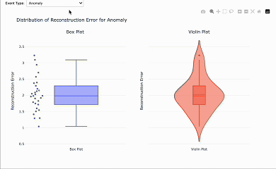

# Plotly Interactive Visualization

This project provides utilities for creating interactive visualizations using Plotly. It includes a Python module with functions for creating box plots and violin plots, as well as a Jupyter notebook that demonstrates these utilities.

## Features

- Create interactive box plots and violin plots for data analysis
- Compare distributions across different event types
- Interactive widgets for dynamic visualization selection
- Customizable plot styling and layout

## Installation

1. Clone this repository:
   ```
   git clone https://github.com/deboblr2020/plotly-interactive.git
   cd plotly-interactive
   ```

2. Install the required dependencies:
   ```
   pip install -r requirements.txt
   ```

## Dependencies

- pandas (>=1.3.0)
- plotly (>=5.3.0)
- ipywidgets (>=7.6.0)
- jupyter (>=1.0.0)

## Usage

### Using the Plotting Utilities

The `plotting_utils.py` module provides functions for creating interactive visualizations. Here's an example of how to use the `create_box_violin_plots` function:

```python
import pandas as pd
from plotting_utils import create_box_violin_plots

# Create or load your DataFrame
df = pd.DataFrame({
    'eventType': ['Normal', 'Normal', 'Anomaly', 'Warning'],
    'reconstruction_error': [0.5, 0.6, 2.1, 1.3]
})

# Create box and violin plots for 'Normal' events
fig = create_box_violin_plots(df, 'Normal')
fig.show()
```

### Jupyter Notebook Demo

The project includes a Jupyter notebook (`plotting_demo.ipynb`) that demonstrates the plotting utilities with sample data:

1. Start Jupyter Notebook:
   ```
   jupyter notebook
   ```

2. Open `plotting_demo.ipynb` in the Jupyter interface.

3. Run the cells to see the visualizations in action.

## Demo

The Jupyter notebook demonstrates:




*Note: Replace the image URL with your actual screenshot once you've added it to your repository.*

## Customizing Visualizations

You can customize the visualizations by modifying the parameters in the `create_box_violin_plots` function or by creating your own custom plots using the Plotly library. The Jupyter notebook includes examples of both approaches.

## Contributing

Contributions are welcome! Please feel free to submit a Pull Request.

## License

This project is licensed under the MIT License - see the LICENSE file for details.
